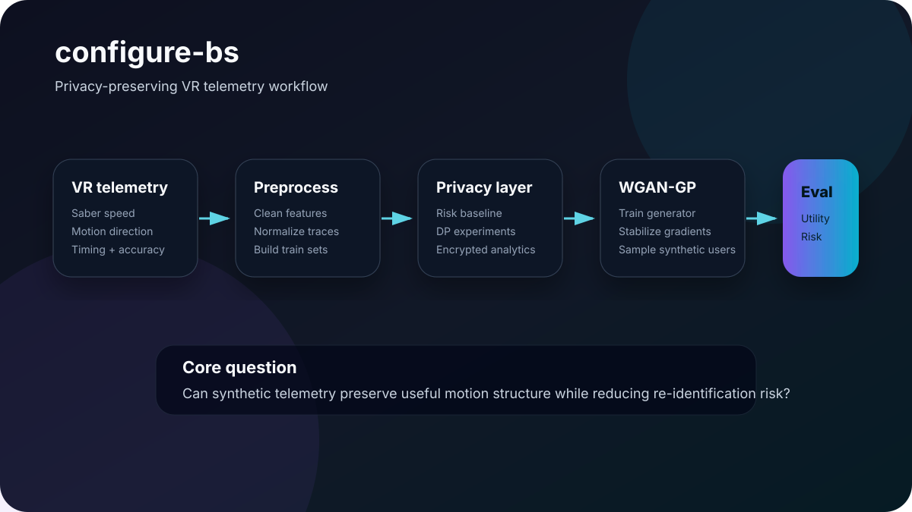

# configure-bs

**Privacy-preserving VR telemetry pipeline using synthetic Beat Saber motion data.**

`configure-bs` explores how rich VR motion telemetry can be transformed into useful synthetic data for research and analytics without exposing raw user behavior. The project combines WGAN-GP generation, differential privacy experiments, evaluation metrics, and optional encrypted analytics notebooks.



## Problem

Beat Saber and similar VR systems generate high-resolution motion traces: saber direction, speed, angular velocity, timing, hit accuracy, and user-specific play patterns. These signals are useful for skill analysis and game design, but they can also identify users.

The project asks:

> Can synthetic telemetry preserve useful motion structure while reducing re-identification risk?

## Workflow

### 1. Data collection and preprocessing

- Beat Saber sessions captured through Unity + SteamVR.
- Motion features cleaned and normalized.
- Data prepared for model training and evaluation.

### 2. Baseline privacy risk

- Re-identification risk is evaluated on raw telemetry.
- Raw motion data is treated as sensitive behavioral data.

### 3. Synthetic data generation

- WGAN-GP model generates synthetic motion-like telemetry.
- Gradient penalty helps stabilize training.
- Generated samples are evaluated against real data distributions.

### 4. Privacy enhancement

- Differential privacy experiments use DP-SGD-style training constraints.
- The goal is to reduce identity leakage while preserving aggregate utility.

### 5. Evaluation and visualization

- Distribution comparisons, statistical tests, and visual plots are used to inspect realism and privacy tradeoffs.

## Key files

```text
configure bs.ipynb             Pipeline walkthrough
data processing.ipynb          Telemetry cleaning and preparation
WGAN-GP.ipynb                  GAN training and synthesis
homomorphic.ipynb              Optional encrypted analytics experiment
saved_generator_model.keras    Trained generator artifact
*.csv                          Skill ratings, mappings, and generated outputs
```

## Tech stack

- Python
- NumPy, pandas, scikit-learn
- TensorFlow / Keras
- TensorFlow Privacy experiments
- Jupyter notebooks
- Matplotlib / Seaborn
- Unity + SteamVR telemetry source
- CKKS / homomorphic-encryption experiments in notebook form

## Setup

```bash
git clone https://github.com/jayasrisng/configure-bs.git
cd configure-bs
pip install -r requirements.txt
jupyter notebook
```

Suggested notebook order:

1. `configure bs.ipynb`
2. `data processing.ipynb`
3. `WGAN-GP.ipynb`
4. `homomorphic.ipynb`

## Research context

If you use this work in academic or applied settings, cite:

> J. S. N. Guthula, H. Rashid, J. P. Springer and A. Basu, "Preserving Privacy in VR Telemetry Data," 2025 IEEE Conference on Virtual Reality and 3D User Interfaces Abstracts and Workshops (VRW), Saint Malo, France, 2025, pp. 1270–1271, doi: 10.1109/VRW66409.2025.00281.

## Case study

See [docs/case-study.md](docs/case-study.md) for research framing and implementation notes.

## Privacy note

Do not publish raw participant telemetry, private Beat Saber logs, or personally identifying motion traces. Use synthetic or anonymized data for examples and screenshots.

## Current limitations

- Notebook-first research code rather than a packaged library.
- Reproducibility depends on local environment and available data files.
- Privacy claims require careful interpretation against the exact threat model and evaluation setup.
- Production use would require a separate pipeline, tests, model cards, and security review.

## License

MIT License — use, modify, and build upon with attribution.
